<div align="center">

### Hi, I'm yihan12 👋

**Frontend Developer** · Changsha · Shenzhen

[](https://yihan12.github.io/)
[](mailto:1245501816@qq.com)
[](https://juejin.cn/user/3016715638158381)
[](https://blog.csdn.net/qq_43485006)


</div>

> 吾生也有涯，而知也无涯。以有涯随无涯，殆已！  
> 写笔记、练算法、拆源码 —— 边做边记，Live and learn.

---

### Now

- 🔭 做 Web 前端，日常 **JavaScript / Vue / React**
- 📝 维护前端笔记与算法练习仓库
- 🌱 持续整理 ES6+、Vue 源码与面试题

---

### Tech Stack

<p align="center">
  
  
  
  
  
  
  
</p>

---

### Featured Projects

| | Project | Stars | About |
| --- | --- | ---: | --- |
| 📒 | [**day-to-day**](https://github.com/yihan12/day-to-day) | ⭐ 18 | 前端日常笔记：Bug、代码片段、工作心得 |
| 📚 | [**Blog**](https://github.com/yihan12/Blog) | ⭐ 11 | 学习过程记录：从基础到实践 |
| 🧠 | [**LeetCode-exercise**](https://github.com/yihan12/LeetCode-exercise) | ⭐ 3 | JavaScript 算法刷题思路与实现 |

<details>
  <summary>More repositories</summary>
  <br />

  - [build-up_ES6-ES12](https://github.com/yihan12/build-up_ES6-ES12) — ES6+ 现代 JavaScript 指南
  - [Frontend-interview](https://github.com/yihan12/Frontend-interview) — 前端面试题整理
  - [Vue2_AI_Analysis](https://github.com/yihan12/Vue2_AI_Analysis) — Vue2 源码分析
  - [yihan12.github.io](https://github.com/yihan12/yihan12.github.io) — 个人博客站点

</details>

---

### GitHub Stats

<p align="center">
  
  
</p>

<p align="center">
  
</p>

<details>
  <summary>Community stats (CSDN / 掘金)</summary>
  <br />
  <p align="center">
    
    
  </p>
</details>

---

### Weekly development breakdown

<!--START_SECTION:waka-->
```text
Markdown         3 hrs 30 mins      ███████████▓░░░░░░░░░░░░░   46.74 % 
JavaScript       1 hr 35 mins       █████▒░░░░░░░░░░░░░░░░░░░   21.32 % 
HTML             48 mins            ██▓░░░░░░░░░░░░░░░░░░░░░░   10.83 % 
CSS3             29 mins            █▓░░░░░░░░░░░░░░░░░░░░░░░   06.59 % 
HTML5            27 mins            █▓░░░░░░░░░░░░░░░░░░░░░░░   06.16 % 
